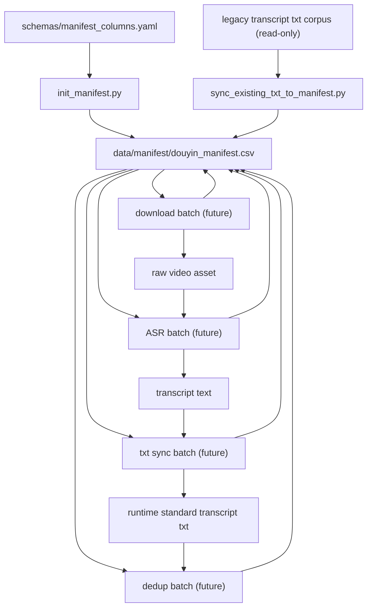

# Phase 1 Data Flow

## Purpose

This document defines the concrete data flow for the Phase 1 foundation chain.
It complements the state machine by showing how rows and files move through the
system.

Phase 1 still stops at the foundation layer. It does not include analysis,
labeling, or skills generation.

## Foundation Chain

The only supported chain in Phase 1 is:

`manifest -> state-driven batch -> ASR quality -> dedup -> transcript landing`

In practice, the row lifecycle expands into these bounded operations:

1. initialize manifest
2. backfill manifest from legacy transcript txt files
3. download missing raw video assets
4. run ASR on rows that are ready
5. land transcript content into runtime standard txt files
6. classify duplicates

## System View

## Phase 1 Operations

## 1. `init_manifest.py`

### Role

Create the runtime manifest file with the correct header and no rows.

### Inputs

- [schemas/manifest_columns.yaml](C:/projects/douyin-wenan/schemas/manifest_columns.yaml)
- runtime manifest target path from config

### Outputs

- `data/manifest/douyin_manifest.csv`

### State impact

- none at row level
- only creates the runtime ledger if absent

### Guarantees

- header order matches schema order
- existing live manifest is not silently overwritten

## 2. `sync_existing_txt_to_manifest.py`

### Role

Read existing standardized transcript txt files from the legacy corpus and
upsert rows into manifest.

### Inputs

- configured legacy input root
- standard transcript txt files
- live manifest if already initialized

### Outputs

- updated `douyin_manifest.csv`

### State impact

- creates missing rows
- refreshes fields that are trusted from txt metadata
- records `legacy_txt_path`
- leaves `txt_sync_status = pending`

### Guarantees

- upsert by stable key
- no duplicate rows for the same work item
- no hidden sidecar CSVs become workflow state

## 3. future download batch

### Role

Download raw video assets for rows whose `download_status == pending`.

### Inputs

- rows from manifest
- source links

### Outputs

- raw video file
- updated manifest row

### State impact

- `download_status`
- `download_time`
- `raw_video_path`
- `notes` on failure

## 4. future ASR batch

### Role

Generate transcript text and quality metadata for rows that already have raw
video assets.

### Inputs

- rows where `download_status == ok`
- raw video or raw audio asset
- ASR provider config

### Outputs

- transcript text in memory or temp artifact
- updated ASR metadata in manifest

### State impact

- `asr_provider`
- `asr_model`
- `asr_time`
- `asr_status`
- `asr_char_count`
- `asr_chars_per_minute`
- `asr_quality_grade`
- `asr_quality_flags`

## 5. future txt sync batch

### Role

Write transcript text into the runtime txt template and land it into the
runtime corpus.

### Inputs

- rows where `asr_status == ok`
- transcript text
- transcript template schema

### Outputs

- runtime standard transcript txt file
- updated manifest row

### State impact

- `txt_path`
- `txt_sync_status`

## 6. future dedup batch

### Role

Evaluate exact duplicate and near-duplicate conditions over transcript rows.

### Inputs

- rows where `txt_sync_status == ok`
- transcript text from standard txt files

### Outputs

- updated manifest row
- optional report file for human review

### State impact

- `dedup_status`
- `dedup_group_id`

## Row Lifecycle Example

### Step 1: row created from existing txt

Manifest row is created with:

- identity fields populated
- source metadata populated when available
- `legacy_txt_path` populated
- `txt_sync_status = pending`
- `dedup_status = unknown`

Depending on backfill policy:

- `download_status` may remain `pending`
- `asr_status` may remain `pending` unless provenance is explicit

### Step 2: operator decides to restore foundation completeness

The row may later be re-ingested:

- download or asset confirmation
- ASR rerun if needed
- dedup pass

### Step 3: row reaches Phase 1 completeness

Row is foundation-complete once:

- `download_status == ok`
- `asr_status == ok`
- `txt_sync_status == ok`
- `dedup_status != unknown`

## Ownership of Artifacts

| Artifact | Owner |
|---|---|
| manifest header and row lifecycle | manifest schema + repository layer |
| runtime transcript txt structure | transcript template schema |
| raw media files | download / ingest layer |
| transcript quality fields | ASR layer |
| duplicate classification | dedup layer |

## Design Constraints

### 1. No hidden control files

No batch script may create a private “truth” file that later scripts depend on
instead of manifest.

### 2. No implicit stage completion

A stage is complete only if the row state says so. Presence of a file alone is
not enough.

### 3. No chained assumptions

Any stage must re-check manifest preconditions before acting. It cannot assume
the prior stage just ran in the same process.

## Implementation Consequences

When Phase 1 code starts:

- `init_manifest.py` will be pure setup
- `sync_existing_txt_to_manifest.py` will be the first real state-updating
  script
- later scripts must follow the exact same row-centric contract
